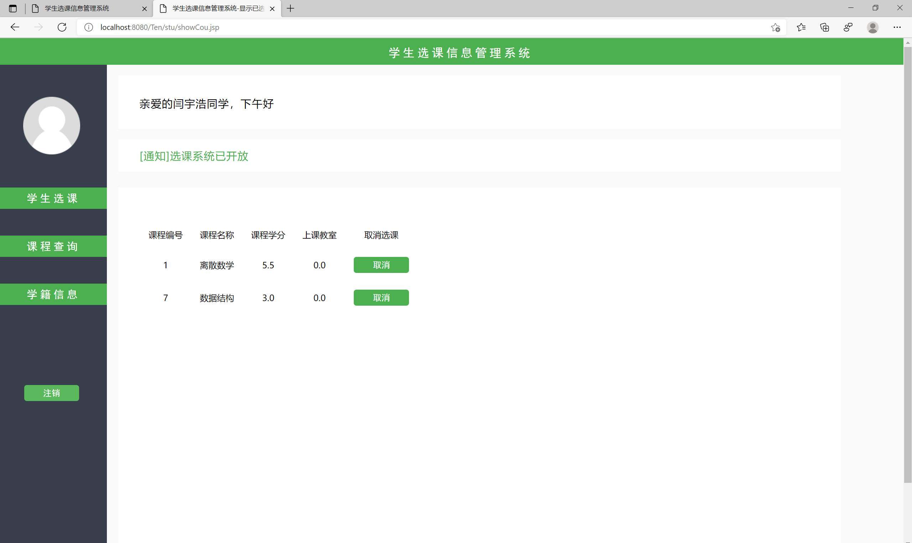

## 基于JSP+Servlet实现的学生选课系统(程序+课程报告)

###  获取sql数据库文件: 从戎源码网 (https://armycodes.com/) QQ: 386869957 QQ群: 377586148
###  所有系统地址: (https://github.com/YuLin-Coder/AllProjectCatalog) 
###  所有项目以及源代码本人均调试运行无问题 可支持远程安装部署调试、定制修改、代码讲解

## 项目介绍
基于JSP+Servlet实现的学生选课系统，主要功能如下

【用户角色】：

1. 学生选课：学生可以浏览可选课程列表，并选择自己感兴趣的课程进行选修。
2. 课程查询：学生可以根据课程名称或教师名称进行课程的查询，并查看课程的详细信息和选课情况。
3. 学籍信息：学生可以查看自己的学籍信息，包括学号、姓名、年级、专业等。

【老师角色】：
1. 选课管理：老师可以创建、编辑和删除课程，包括课程名称、教师姓名、上课时间等。
2. 学生信息：老师可以查看学生的选课信息，包括学生姓名、所选课程、成绩等。
3. 信息查询：老师可以根据学生姓名或学号进行学生信息的查询，并查看学生的选课情况和成绩。

以上是基于JSP+Servlet实现的学生选课系统的主要功能。学生可以选课、查询课程和查看学籍信息；老师可以管理选课、查看学生信息和查询信息；

## 项目技术
- 编程语言：Java
- 数据库：MySQL
- 前端技术：JSP、JavaScript、bootstrap、JQuery
- 后端技术：Servlet、JDBC

## 运行环境
- JDK版本：JDK1.8及以上
- 开发工具：IDEA、Ecplise、Myecplise都可以
- 数据库: MySQL5.7及以上

## 运行截图

